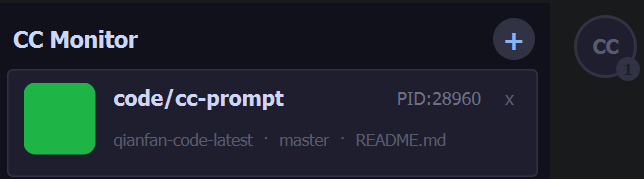

# CC Monitor

Windows 桌面悬浮监控工具，实时追踪 [Claude Code](https://docs.anthropic.com/en/docs/claude-code) 会话状态。

## 功能特性

- **多会话监控** — 同时追踪多个 Claude Code 会话，每个会话独立显示状态和信息
- **悬浮球** — 常驻屏幕边缘，一眼掌握所有会话的聚合状态（等待审批/思考中/卡住/空闲），徽标显示会话数量或 `!` 表示需要关注
- **主界面** — 点击悬浮球展开，显示每个会话的详细信息（PID、模型、Git 分支、活跃文件、Token 用量等）
- **主界面跟随** — 拖动悬浮球时主界面实时跟随，自动保持在球的左侧或右侧，空间不足时切换方向
- **状态通知** — 会话需要审批、卡住或完成任务时弹出提示浮窗
- **声音提醒** — 不同状态转换播放对应音效，支持自定义音效文件
- **一键跳转** — 点击会话卡片，自动激活对应的终端或 VSCode 窗口
- **边缘吸附** — 悬浮球拖拽释放后自动吸附到最近的屏幕边缘
- **位置记忆** — 悬浮球位置自动保存，重启后恢复

## 状态颜色

| 状态 | 颜色 | 含义 |
|------|------|------|
| 等待审批 / 错误 | 红色 | 需要你立即处理 |
| 思考中 | 蓝色 | AI 正在工作 |
| 卡住 | 黄色 | API 无响应 |
| 空闲 | 绿色 | 等待输入或已完成 |

## 截图



## 下载安装

从 [Releases](../../releases) 下载最新版本的 zip 包，解压后运行 `CC-Monitor.exe`，无需安装。

## 自定义音效

在 `CC-Monitor.exe` 同目录下创建 `sounds.ini`：

```ini
[Sounds]
task_completed=task_success_smooth.wav
needs_approval=task_confirm_smooth.wav
session_stuck=task_stuck_smooth.wav
```

将对应的 `.wav` 文件放在同一目录下即可。

## 技术栈

- Qt 6.8.0 / C++17 / llvm-mingw 64-bit
- Win32 API（进程激活）
- 数据来源：`~/.claude/sessions/` + `~/.claude/projects/` 下的 JSONL 日志

## 版本历史

| 版本 | 日期 | 说明 |
|------|------|------|
| v0.3.1 | 2026-05-31 | 主界面跟随悬浮球移动（含边界处理） |
| v0.3.0 | 2026-05-30 | 悬浮球 UI、声音提醒、弹性布局 |
| v0.2.2 | 2026-05-29 | 无边框 UI、Bug 修复、扫描优化 |
| v0.2.1 | 2026-05-28 | 提升状态判断准确性与 JSONL 鲁棒性 |
| v0.2.0 | 2026-05-27 | 修复 JSONL 匹配，新增任务完成通知 |
| v0.1.0 | 2026-05-25 | 初始发布 |

## 已知问题与贡献

CC Monitor 目前仍有一些未解决的问题。本人技术有限，这些问题暂时没有很好的解决方案。

详细的问题说明和未来版本规划请查看 [ROADMAP.md](ROADMAP.md)。

如果你有想法或改进，非常欢迎提交 Issue 和 PR！

## 开源协议

MIT
